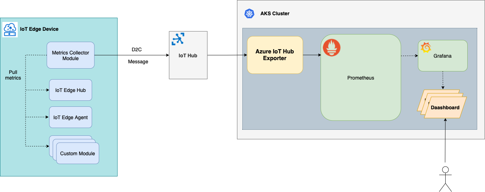

# Azure IoT Hub exporter

Azure IoT Hub exporter listens to Azure IoT Hub [messages endpoint](https://docs.microsoft.com/en-us/azure/iot-hub/iot-hub-devguide-messages-read-builtin#read-from-the-built-in-endpoint) and exposes IoT Edge metrics to Prometheus.



IoT Edge metrics are exported to IoT Hub by the metrics collector module as it is described in [Collect and transport metrics](https://docs.microsoft.com/en-us/azure/iot-edge/how-to-collect-and-transport-metrics?view=iotedge-2020-11&tabs=iothub) approach (Option 2) via `device-to-cloud` messages. Azure IoT Hub exporter converts the metrics messages to Prometheus format and exposes them to be scrapped by Prometheus server.

## Motivation

[Collect and transport metrics](https://docs.microsoft.com/en-us/azure/iot-edge/how-to-collect-and-transport-metrics?view=iotedge-2020-11&tabs=iothub) describes how to deliver metrics to IoT Hub via standard `device-to-cloud` channel. It's also possible to build a [cloud workflow](https://github.com/Azure-Samples/iotedge-logging-and-monitoring-solution#monitoring-architecture-reference) to push the metrics to Log Analytics workspace and consume them with `Azure Workbooks` and `Azure Alerts`. But waht if we build our observability approach on top of Prometheus and Grafana? Metrics are exposed by IoT Edge modules in Prometheues format and we want them to land in a Prometheus server so that we can use PromQL to build Grafana dashboards and Prometheus alerts. The purpose of Azure IoT Hub exporter is to close the gap between IoT Hub and Prometheus server.


## Installation

Add *Azure IoT Hub exporter* repository to Helm repos:

```shell
helm repo add azure-iothub-exporter https://microsoft.github.io/azure-iothub-exporter/
```

Install *Azure IoT Hub exporter*:

```shell
helm upgrade -i azure-iothub-exporter azure-iothub-exporter/azure-iothub-exporter \
--namespace <NAMESPACE> \
--set eventHubConnectionString=<IoT Hub messages endpoint connection string>
```

Refer to [Read device-to-cloud messages from the built-in endpoint](https://docs.microsoft.com/en-us/azure/iot-hub/iot-hub-devguide-messages-read-builtin#read-from-the-built-in-endpoint) for the details on the `IoT Hub messages endpoint connection string`.


## Prometheus configuration

Add the following job defintion to the prometheus config:

```yaml
- job_name: azure-iothub-exporter
  scrape_interval: 1m
  metrics_path: /iotmetrics
  static_configs:
  - targets: ["azure-iothub-exporter.<NAMESPACE>.svc.cluster.local:8080"]
```

## Contributing

This project welcomes contributions and suggestions. Most contributions require you to agree to a Contributor License Agreement (CLA) declaring that you have the right to, and actually do, grant us the rights to use your contribution. For details, visit <https://cla.microsoft.com.>

This project has adopted the [Microsoft Open Source Code of Conduct](https://opensource.microsoft.com/codeofconduct/). For more information see the [Code of Conduct FAQ](https://opensource.microsoft.com/codeofconduct/faq/) or contact [opencode@microsoft.com](mailto:opencode@microsoft.com) with any additional questions or comments.

